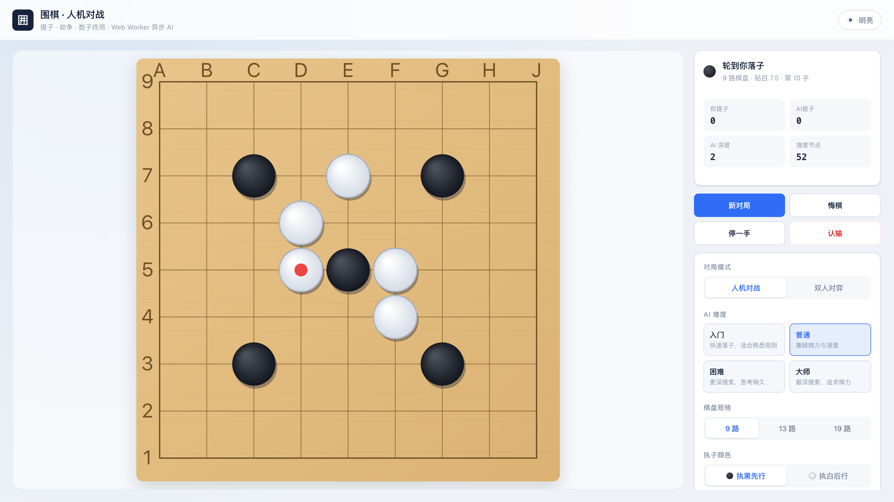
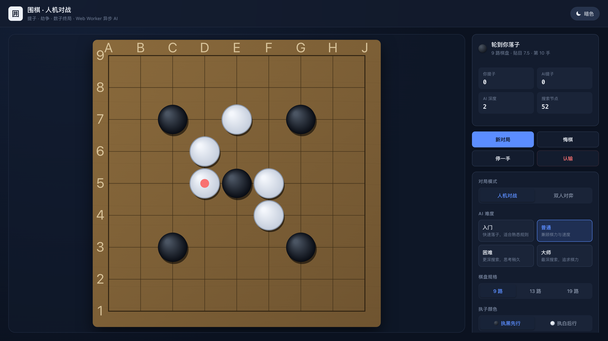
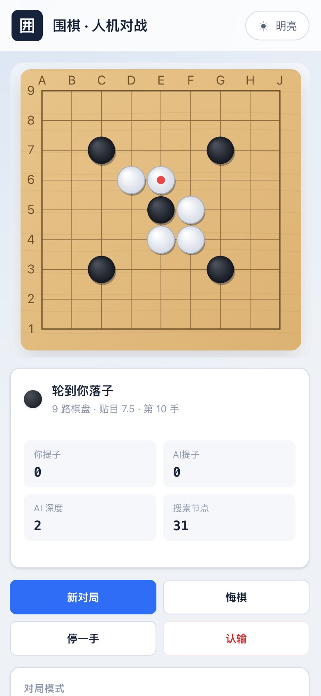

<div align="center">

# 围棋 · 人机对战

**纯前端围棋 AI** · 提子 / 劫争 / 中国规则数子终局 · Negamax + Alpha-Beta 剪枝 + Web Worker 异步思考

[](https://github.com/zhq734/go-ai/actions/workflows/deploy.yml)
[](https://vuejs.org/)
[](https://www.typescriptlang.org/)
[](https://vite.dev/)
[](LICENSE)

[在线对局](https://zhq734.github.io/go-ai/) · [功能特性](#-功能特性) · [AI 算法](#-ai-算法) · [本地运行](#-本地运行)

</div>

---

## 🎮 项目简介

> 🔗 **在线试玩：<https://zhq734.github.io/go-ai/>**

一款无需后端、可离线游玩的围棋人机对战游戏。完整实现围棋核心规则——**气、提子、自杀禁着、劫争、停一手、中国规则数子终局**，
AI 基于 **Negamax 搜索**，配合 **Alpha-Beta 剪枝**、**迭代加深**、**置换表**、**候选点启发式排序** 与 **影响力静态评估**，
全部搜索运行在浏览器 **Web Worker** 中，界面全程保持流畅。

| 明亮主题 | 暗色主题 |
| :---: | :---: |
|  |  |

<div align="center">

| 移动端自适应 |
| :---: |
|  |

</div>

---

## ✨ 功能特性

### 围棋规则

- **气与连通块**：基于 BFS 的整块棋连通性与气数计算。
- **提子**：自动提掉无气棋子，支持一次提掉多子整块。
- **自杀禁着**：禁止落子后自身无气的着法（提子后自填合法）。
- **劫争**：识别经典劫形，禁止立即回提，必须寻劫后方可再提。
- **停一手与终局**：连续两次停一手自动进入终局数子。
- **中国规则数子**：棋子数 + 所围空点，贴目 7.5 目，自动判定胜负。

### AI 引擎

| 难度 | 搜索深度 | 候选宽度 | 思考预算 | 特点 |
| :---: | :---: | :---: | :---: | :--- |
| 入门 | 1 层 | 6 | 120ms | 快速落子，带随机扰动 |
| 普通 | 2 层 | 8 | 420ms | 兼顾棋力与速度 |
| 困难 | 3 层 | 10 | 1.2s | 更深搜索，攻防更稳 |
| 大师 | 4 层 | 12 | 2.4s | 最深搜索，追求棋力 |

### 交互与体验

- **Canvas 棋盘**：矢量风格绘制，支持任意分辨率与高分屏（DPR 自适应）。
- **自适应布局**：Flexbox + Grid，桌面双栏、移动端单栏，棋盘随窗口缩放。
- **多主题**：明亮 / 暗色 / 跟随系统三态，全部颜色通过 CSS 变量管理。
- **页面缓存**：`keep-alive` + Pinia 持久化，切换页面不丢失对局状态。
- **对局记录**：棋谱列表自动滚动，显示手数、颜色、坐标与提子数。
- **终局浮层**：展示胜负与比分，支持再来一局与悔棋复盘。
- **音效**：WebAudio 合成落子 / 提子 / 终局音，无需外部资源。

---

## 🤖 AI 算法

```text
候选点生成（邻域 2 格）
        │
        ▼
启发式排序（提子 / 救子 / 打吃 / 气数 / 边角 / 密度）
        │
        ▼
迭代加深 ──► Negamax + Alpha-Beta 剪枝
        │            │
        │            └── 置换表（局面键 + 深度 + 上下界）
        │
        └──► 影响力静态评估（棋块厚薄 + 势力范围）
```

**评估函数**由三部分组成：棋子厚势（双方子数差）、棋形价值（气数厚薄，打吃重罚）与邻近影响力场，
保证「提子优于被打吃」这类围棋基本判断在浅层搜索中也能正确体现。

---

## 🧪 测试

项目遵循 TDD 红-绿-重构流程，测试覆盖棋盘规则、劫争、数子、对局流程、AI 决策与自我对弈。

```bash
npm test          # Vitest 单元测试（33 项）
npm run typecheck # vue-tsc 类型检查
npm run build     # 生产构建
```

浏览器端验收（需先启动 `npm run preview`）：

```bash
python3 scripts/verify_ui.py http://127.0.0.1:4173/
```

覆盖 19 路切换、数子终局、认输浮层、主题与模式切换，并断言无控制台报错。

---

## 🚀 本地运行

```bash
npm install
npm run dev       # 开发服务器
npm run build     # 生产构建
npm run preview   # 预览构建产物
```

### 生成 README 截图

```bash
npm run preview
python3 scripts/capture_screenshots.py http://127.0.0.1:4173/
```

---

## 📁 项目结构

```text
src/
├── components/        # 棋盘、状态、控制、棋谱、结果浮层等 UI 组件
├── composables/       # AI Worker、主题、音效组合式函数
├── core/              # 围棋规则引擎（board / rules / scoring / game / ai）
├── router/            # 单页路由
├── stores/            # Pinia 对局状态与偏好持久化
├── styles/            # 主题令牌与全局基础样式
├── views/             # 对局主视图
└── workers/           # AI 计算 Web Worker
tests/                 # 单元测试（棋盘 / 劫争 / 数子 / 对局 / AI / 自我对弈）
scripts/               # 截图与端到端验收脚本
```

---

## 📄 许可

[MIT](LICENSE) © 2026 zhenghq
